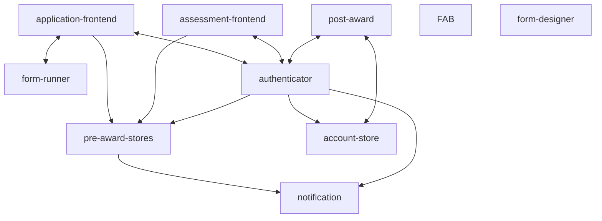
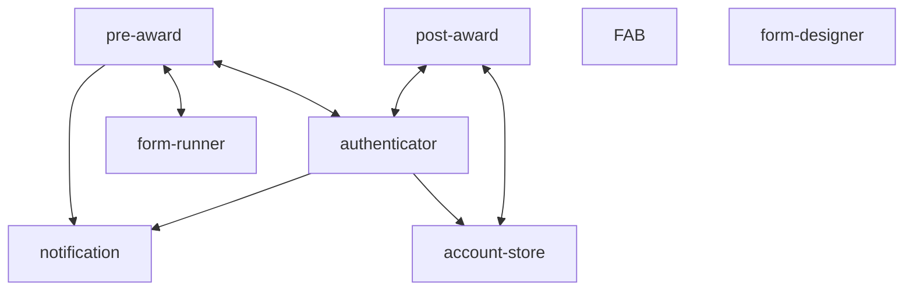

```
Title: Combining pre-award frontends with pre-award-stores
Owner: The Platform Team
Collaborator(s): -
Created on: 2024-12-04
Status: Approved
Finalised on: 2024-12-12
```

## Overview

Three of the pre-award data stores (fund-store, application-store, assessment-store) have now been combined into a single store service. We propose continuing with the simplification of the Funding Service's technical architecture by moving from separate frontend (HTML-serving) and backend (API/data serving) services to a full-stack more "monolithic" approach.

## What is the current state?



In the "pre-award world", we have two "frontend" services: `application-frontend` and `assessment-frontend`. These are publicly-accessible ECS services serving HTML and talking to an internal API (pre-award-stores) to fetch any data it needs when handling user requests.

Authentication is handled by a separate authenticator (and account-store API). The result of authentication is a cookie in the user's browser that is read/checked by all Funding Service services.


## Why should we change?

In [our original RFC about consolidation](https://github.com/communitiesuk/funding-service-requests-for-comments/discussions/3), under "How should we address this?", we have now completed step 1: combine the pre-award stores* (caveat: account-store TBC). Step 2 is about bringing the frontends in, which this RFC looks to cover in more detail.

Our historical architecture has mostly been modelled around the concept of microservices, which is meant to bring benefits that have not materialised in the context of the Funding Service.

We currently have to deal with many of the negatives of a distributed monolith, which include:
- New starters have difficulty onboarding because of the complexity of the architecture
- Errors are distributed and difficult to track down, debug, fix
- Making a change (eg adding a feature) requires changes across multiple services and requires a high level of experience with concepts related to distributed services
- Rendering a single HTML page requires multiple calls to the API backends, which increases latency and worsens the user experience
- Fund configuration is distributed across the codebase, making it harder to treat funds as data/configuration rather than code

By reducing the number of services and the amount of technical infrastructure we maintain, we hope to make it possible to deliver work faster and more reliably. 


## How should we address this?




We propose "lifting and shifting" the existing pre-award frontends into a new application that contains all of the code from `frontend`, `assessment-frontend`, and `pre-award-stores`. This would leave us with (mostly) a single pre-award service that serves HTML directly and talks to the DB directly, with no HTTP API in the middle. We would keep a clean internal API interface (through Python modules), but not anything that goes over the wire.

[A separate RFC has been raised](https://github.com/communitiesuk/funding-service-requests-for-comments/discussions/14) to discuss what we want to do about authenticator and account-store, and whether they should also be combined or if there are reasons to keep them separate.

The process for this would likely be (names TBC):

* "Lift and shift" `frontend` and `assessment-frontend` into a single new frontend app, `pre-award-frontend`
* "Lift and shift" `pre-award-frontend` and `pre-award-stores` into a single new full-stack app, `funding-service-pre-award`
* Rationalise/consolidate the combined code to remove duplication and simplify data access (eg a cleaner/clearer non-HTTP API interface

### Out of scope of this RFC

* What do we do about authenticator/account-store and how do they fit into a consolidated world

## What alternatives are we discarding?

1. Keep frontends and APIs separate
  i. This is the current world, and it comes with all of the problems described above
2. Keep apply and assess services separate
  i. These are separate user bases and there has been some historical suggestion that this is a reason to keep the code separate, but we don't think this is a useful distinction at the moment. Funding Service's post-award service also serves two distinct user groups through one app, so there is precedent for doing this - and no noticeable pain or drawbacks came from it
  ii. We have already combined the application-store and assessment-store, so this ship has arguably sailed

## Who will be affected?

The users should see no change at all in how the services work.

Funding Service technical teams will be the main people affected as combining the existing services will impact how they work on them.

The Live Services, Forms and Data Services teams will all be kept in the loop through timeline check-ins, RFCs and transparent sharing of key dates. Any downtime to services will be worked out in collaboration with all these teams to ensure it doesn't clash with any ongoing work.

## Who will benefit?

In the long run, everyone! By consolidating the services in this way and reducing the complexity of the whole pre-award space (and perhaps eventually the whole funding service space) we'll reduce the number of moving parts and make it a lot easier to make, test and deploy changes to the service, debug and track requests & responses, reduce the amount of places where a Fund has to be configured and therefore quicker to onboard funds, and make it possible and simpler to persist one consistent data entity through the two stages of the funding lifecycle (and potentially onward after that).

### Tangential/optional benefits
We may be able to move away from our existing domain structure, which is broadly based around the names of the repositories. Having all of the code in one service means we could more easily have the option of a single service domain.


## What are the key risks to manage or mitigate?

* As we condense more of the apps into fewer apps/a single app, there is potential for developers to step on each others toes and have problems like merge/PR conflicts.
  * This can be mitigated through appropriate planning of work and good developer hygiene in making focused and small changes rather than broad sweeping PRs that do a lot of things at once.
  * It can also be mitigated by having a well-structured codebase, ie modules and interfaces.
  * We can make better use of feature flagging to make incremental changes without affecting end users.
 * How long will we have to do code freezes and what impact will this have on other teams' delivery?
   * Depending on the way we decide to run the migration, there may need to be code freezes on the frontends, stores, or both for some amount of time. The platform team will put effort into making any required code freeze as minimal as possible, and work with other teams to make sure that it's done in a way that causes minimal disruption and delay to feature delivery. For reference, the `assessment-store` lift and shift code freeze was only 2 days.
 * When combining application-frontend and assessment-frontend, care will need to be taken to make sure that styling remains the same on both apps. Each app has broadly distinct sets of styles, and use different versions of GOV.UK Frontend (4.0.0 and 4.7.0). Some amount of manual checking will need to be done to make sure that all of the pages still look and function correctly.
 * There are some funds going live from December 11th - which may be around when we are doing some of this work. As above, we'll communicate and deconflict with other teams as needed.

### Already mitigated risks
 * As our AWS addons (eg RDS, S3 buckets, queues etc) are already at the "environment"-level, we don't need to do any additional migrations to allow a new service to talk to them.
