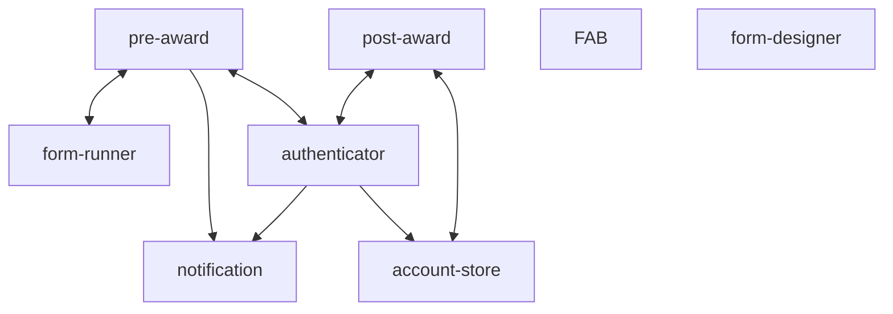
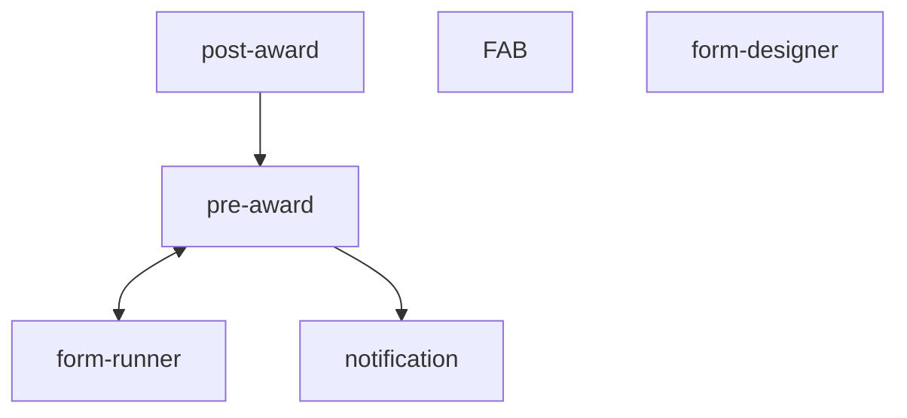

```
Title: Bring account store and authenticator into the combined pre-award monolith
Owner: Marc Usher
Collaborator(s): Steven Fountain, Gideon Goldberg, Sam Williams
Created on: 2024-12-04
Status: Approved
Finalised on: 2024-12-12
```

## Overview

This proposal presents a number of options of what we can do with the `account-store` and `authenticator` services in the new world of a (mostly) monolith pre-award architecture (which may or may not include the post-award monolith service), and proposes which of those options we believe is the best approach for the direction of travel of the service and the resource available.

## What is the current (post front-end/stores merger) state?



In the "pre-award world", we have two "frontend" services - which are publicly-accessible ECS services serving HTML and talking to an internal API (`pre-award-stores`) to fetch any data it needs when handling user requests. We also have one "backend" (API/data serving) service, the aforementioned and much loved `pre-award-stores`. These are proposed to be merged into one `funding-service-pre-award` monolith service in [this RFC](https://github.com/communitiesuk/funding-service-requests-for-comments/discussions/13), which is reflected in the diagram above.

This leaves `account-store` and `authenticator` as separate microservices which could still be part of the consolidation work (the `form builder/designer` and `fund application builder` services are currently out of scope for this consolidation work, and the `notification` service will be discussed in a separate RFC).

Authentication is handled by the separate `authenticator` (HTML front-end and public API service) and `account-store` (API). The result of authentication is a cookie in the user's browser that is read/checked by all Funding Service services. 

`account-store` and `authenticator` are currently used by pre-award for authentication and user roles/permissions and by post-award for authentication and Find download stats collection.


## Why should we change?

* Authenticator's hybrid approach of being both an HTML front-end and public API service has led to a number of cyber security issues
* The current set up exacerbates the issues highlighted in all other RFCs around the negatives of a distributed monolith, including not having true separation of concerns between services, scattered fund configuration (including in `authenticator`) and complexity in making changes across multiple services
* Not changing this would make our proposed architectural approach inconsistent - we are moving towards a (mostly) monolith architecture and having these services still separate would leave them as outliers and not address the issues highlighted above


## How should we address this?

We propose that we should include `account-store` and `authenticator` in our pre-award consolidation, which would result in one combined service consisting of:

- `fund-store`
- `application-store`
- `assessment-store`
- `account-store`
- `application-frontend`
- `assessment-frontend`
- `authenticator`

The order of operations is still TBC but the steps would follow the approach taken in all the other consolidation work, namely start with "lift and shift" until we have a working monolith service and then move on to "rationalise" the code.

This would leave us with the following (nb. this makes it seem like post-award is the king of everything - it's not, it's just mermaid not playing ball 😆):




## What alternatives are we discarding?

### Just include `account-store` in consolidation
Leave `authenticator` out of the mix as a separate service but include `account-store` in our consolidation work so that we are left with just one database for the consolidated pre-award architecture.

#### Why are we discarding this? 
The `account-store` (and therefore the combined `pre-award` service which it would be part of) would need a public-facing API to continue being able to talk to `authenticator`, which has security implications.

### Leave them both out of the consolidation
Continue with the consolidation work but leave `account-store` and `authenticator` out of scope and keep them as separate microservices.

#### Why are we discarding this?
* This would leave us with an inconsistent architectural approach and in a halfway state between more monolith architecture and microservice, a state which doesn't necessarily address the negatives of a distributed monolith or reduce the developer overhead
* We anticipate needing to do more sophisticated user permissions which is made significantly easier by all data being in one place


## Who will be affected?

The users should see no change at all in how the services work.

Funding Service technical teams will be the main people affected as combining the existing services will impact how they work on them.

The Live Services, Forms and Data Services teams will all be kept in the loop through timeline check-ins, RFCs and transparent sharing of key dates. Any downtime to services will be worked out in collaboration with all these teams to ensure it doesn't clash with any ongoing work.


## Who will benefit?

This would be the final store and front-end service to be consolidated, meaning all the proposed rationalisation and simplification work (where the real value add of the consolidation work will be realised) can be done in earnest.

Even without this rationalisation work, we will have significantly reduced the number of moving parts and made it a lot easier to make, test and deploy changes to the service, debug and track requests & responses, and make it possible and simpler to persist one consistent data entity through the two stages of the funding lifecycle (and potentially onward after that).


## What are the key risks to manage or mitigate?

Any admin actions or other calls to the `account-store` (eg. from lambdas) will need to be reconfigured or replaced, eg. moved to another interface such as Flask Admin which will need to be secured or run as a recurring job in AWS. We will do a thorough audit for all calls to and actions which use the `account-store` and scope out the extent and complexity of this work.

`authenticator` and `account-store` are currently separate and used by both pre-award and post-award services. Bringing these services into the pre-award space will affect how the post-award service interacts with them. It currently calls the `account-store` to generate statistics on Find download usage, and uses `authenticator` to authenticate users. The `account-store` interaction comes under the risk listed above, and the `authenticator` link could continue to work and could just read the cookie on the client side.

There is also an argument to be made that, of all the microservices in our architecture, having a separate authentication service is the one that makes the most sense. But as discussed above, this has led to a number of cybersecurity issues, which would be mitigated by this proposed consolidation. Bringing them into the monolith service also doesn't preclude us moving to a third-party authentication service in the future should we decide to offload the risk of maintaining this ourselves.
