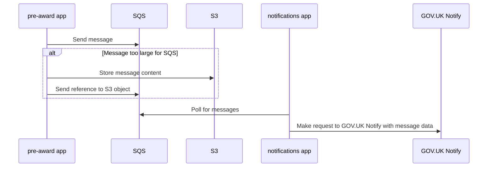
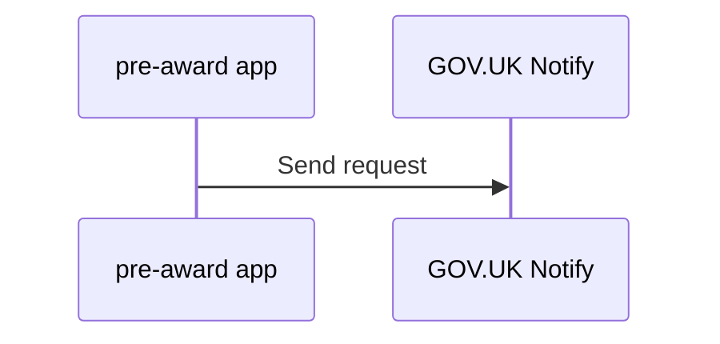

    Title: Make calls to GOV.UK Notify synchronously
    Owner: Samuel Williams
    Collaborator(s): The Platform Team
    Created on: 31/12/2024
    Status: Accepted
    Finalised on: 06/01/2025

## Overview

We currently send emails using GOV.UK Notify via a message queue. The `pre-award` application writes a message to SQS. 'Large' messages to the queue will get written to S3 and sent by reference instead. The messages get picked up by a worker on the `notifications` service. That worker will then send the email using GOV.UK Notify.

This RFC proposes removing the message queue and just sending emails synchronously within the request/response cycle.

## What is the current state?

Below is a rough representation of the current sequence of interactions for sending an email.

## Why should we change?

This infrastructure is suitable for sending millions of emails a day, but we probably only send 10s or 100s at our peak. At our scale, this level of distributed architecture makes it harder and slower for us to iterate and build the service.

The notification service is further aware of fund-specific configuration to send emails, which makes it harder for us to onboard funds without developer work, and it makes adding new funds more error-prone.

The code supporting Notifications has a few layers of abstraction, and makes use of lots of dicts/objects which aren't well type hinted/clearly structured, making it hard for developers to reason about the contents of messages/dicts and what information is available.

By technically distributing the code that needs to send emails and the code that sends emails (through a queue), it becomes challenging to handle errors. A "successful" response indicates that you've written to a queue and not that Notify was able to process sending an email

## How should we address this?

At our scale, we should value simplicity of implementation and prioritise a simple mental model that is easy to reason about. By sending emails synchronously, we may see a slight increase in latency of pages that send emails, but we will have a service that is easier to work on and understand. The benefits of developer productivity, in this case, greatly outweigh the impact on users of some pages seeing ~100-250ms added latency.

Errors will also be easier to investigate, understand, and fix because Sentry logging should be more reliable.

## What alternatives are we discarding?

* Keeping the existing `notification` microservice and message queue.

## Who will be affected?

* Users may see slightly slower page loads on pages that send emails (eg submitting an application). The difference should be negligible and unnoticed in most cases.

## Who will benefit?

* New developers to the team will have less infrastructure and code to understand
* Developers working on the service should be able to add new types of email notification more easily.
* The product will benefit as it moves us towards a world where funds are configurable through the service, not by developers.

## What are the key risks to manage or mitigate?

* One of the benefits that the distributed system gives us is that an issue with GOV.UK Notify's API will not throw errors during the HTTP request/response cycle, because those errors will be surfaced on a separate app. Developers will need to be cognisant of this fact and consider appropriate error handling for emails in each request. In some cases, it may be appropriate to terminate the entire request and rollback a transaction if an email fails. In others, we might want to swallow the error and log it to Sentry for later investigation, but still commit the transaction and return a ~200 response.
  * If GOV.UK Notify suffers a prolonged outage and we haven't considered this, then parts of our service may cascade those failures to users.
  * GOV.UK Notify has had [no reported incidents of downtime](https://status.notifications.service.gov.uk/history) in the last three months and is a generally-stable, highly-available system.

To mitigate the "try to send an email once and give up if that fails" side effect of these proposed changes, we could use something like the [transactional outbox](https://microservices.io/patterns/data/transactional-outbox.html) pattern for logging emails that need to be sent, along with a scheduled job to retry failures. Emails that succeed immediately could mark the relevant field in the DB as 'sent', and the scheduled job could scan every x minutes/hours for committed-but-unsent messages and retry them.
